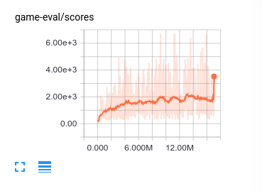

# Galaxian

This is a project to play Galaxian (NES) using deepmind's a3c algorithm.

## How to

To train:

    python galaxian2.py --train --train_pnn --num_workers=6 --ui_tasks=1 --eval_tasks=1 --port=5000
    watch "tail /tmp/galaxian-*.stderr -n1; nvidia-smi"
    tensorboard --logdir=logs/2.34

If the training expodes, reset to good checkpoint, then set lower learning rate, e.g.

    --learning_rate=1e-5

Search mode:

    python galaxian2.py --train=False --ui_tasks=0 --eval_tasks=0 --search --send_paths

## Result

### Training

After training for ~24h, 17M steps, 6 workers, the agent gets to ~1800 scores.

Video:

### Search mode

Tree search (max depth of 8) with predicted enemy paths (the red dots), the agent gets to 5000+ scores.

Video:

### Human play

As a comparison, human (me) play average to ~2800 scores.
